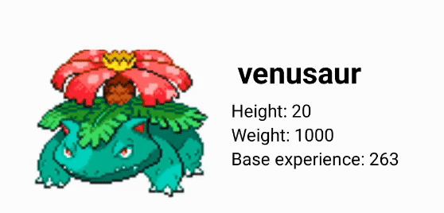
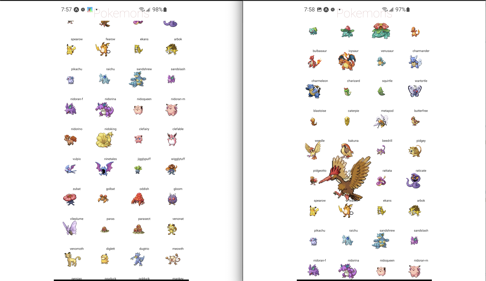

# Pokemon Native

## Blogs

- [Make FlatList Performant with Large Dataset](https://medium.com/stackademic/make-flatlist-performant-with-large-dataset-996704c1d009)
- [Use Touch Screen and Pan Gesture](https://medium.com/@windmaomao/use-touch-screen-and-pan-gesture-3057b26164b6)
- [Apply gravitation to your app](https://medium.com/@windmaomao/apply-gravitation-to-your-app-6560e67798d2)
